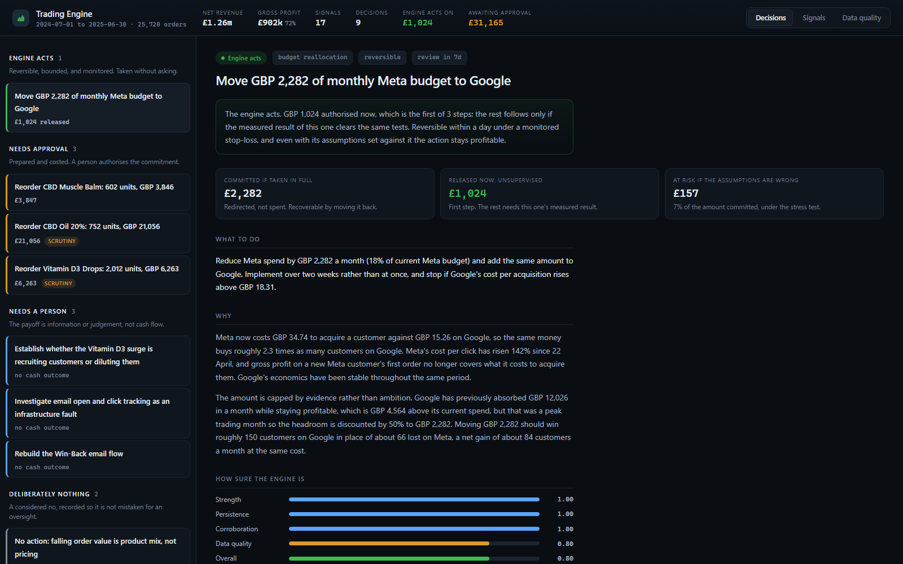
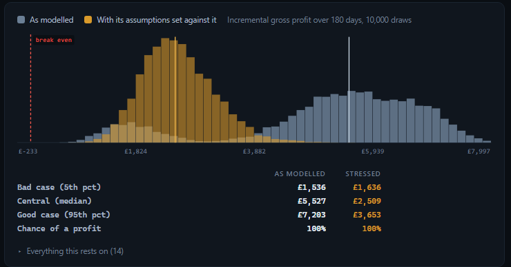

# Trading Engine

A decision engine for a UK supplements brand. Twelve months of Shopify, Meta,
Google and Klaviyo exports go in. What comes out is not a dashboard but a short
list of specific actions, each with the evidence behind it, a simulated range of
outcomes, and a verdict on whether a machine should be allowed to take it
without asking anyone.

**Start with [`notebooks/walkthrough.ipynb`](notebooks/walkthrough.ipynb).** It is
the narrative version of everything below, with the charts, and it renders on
GitHub without needing to run anything. If you would rather click than read,
`docker compose up console` puts [the same decisions](#the-console) in a
browser on port 8000.

---

## What it decided

Nine decisions came out of the twelve months. One the engine takes itself.

| | Decision | Money | Verdict |
|---|---|---|---|
| **Acts alone** | Move £2,282 a month of Meta budget to Google | £1,024 released now, rest on results | auto-execute |
| **Needs a signature** | Reorder CBD Oil 20% | £21,056 | routine |
| | Reorder CBD Muscle Balm | £3,846 | routine |
| | Reorder Vitamin D3 Drops | £6,263 | **worth arguing about** |
| **Needs a person** | Find out if the Vitamin D3 surge recruits or dilutes | — | escalate |
| | Check email tracking as an infrastructure fault | — | escalate |
| | Rebuild the Win-Back email flow | — | escalate |
| **Deliberately nothing** | The fall in average order value | — | suppress |
| | The collapse in customer retention | — | suppress |

The last two rows are the ones worth reading about.

---

## The two biggest findings in the data are both things you should not act on

**Customer retention appears to have collapsed to zero.** The share of each
month's new customers who buy again within 90 days falls from 32% to nothing,
and stays there for every cohort from December onward. Taken at face value this
is a five-alarm fire and the obvious response is an urgent retention programme.

It cannot be true. If nobody acquired after November ever came back, repeat
purchases would have to dwindle month by month as the older customers were used
up. Instead, right through the period when every cohort supposedly contains
nobody who returns, a *quarter of all orders are repeat purchases* — and 98% of
2025's repeat orders come from customers acquired in the first three months of
the dataset.
Repeat buying here is not a behaviour of the customer base. It is a fixed group
baked in when the data was produced.

The engine runs three independent tests, concludes the collapse is an artifact,
and blocks any recommendation built on it. The cost of that conclusion is real:
lifetime value cannot be measured on this data, so the standard way of judging
whether acquisition spend is worthwhile is simply unavailable. Every judgement
about paid media here falls back to a stricter question — does the profit on a
customer's *first* order cover what it cost to win them.

**Average order value fell 8%.** The reflex response is a promotion. But basket
sizes have not changed and discounting has not changed. The entire fall is one
cheaper product taking a larger share of sales. A promotion would be aimed at
something that is not happening.

Both are recorded as explicit no-action decisions with their reasoning, rather
than omitted. Silence and oversight look identical from the outside, and if
these were simply missing from the output the reasonable assumption would be
that the engine had failed to notice the two largest movements in the data.

---

## What it did find

**Meta stopped paying for itself.** Its cost per click more than doubled from
late April, and the gross profit on a new Meta customer's first order no longer
covers what it costs to acquire them. Google's has been stable throughout, at
less than half the acquisition cost.

Roughly a quarter of orders cannot be traced to any channel, so neither
channel's true acquisition cost is a single number. The recommendation is made
anyway because Meta is worse than Google at *both* ends of that range. The
conclusion does not depend on how the untraceable orders are allocated, which is
what makes it safe to act on.

**Three products will run out of stock before a replacement order could arrive.**
Two of those reorders are routine. The Vitamin D3 one is not, and the difference
is explained below.

**Four email flows lost engagement on the same day.** They target different
audiences at different points in the customer relationship and share nothing
except the sending infrastructure. Orders per recipient did not move. That is an
account-level tracking fault, not four separate content problems, and it is
routed to engineering as one incident rather than to marketing as four.

The instruction attached to it matters: **do not prune unengaged subscribers on
the basis of these open rates.** That is the standard response to a sustained
drop, it permanently removes reachable customers, and if the opens are simply
not being recorded it would delete a working audience to fix a reporting bug.

---

## How it decides what it may do alone

The engine will not act on its own just because it is confident. Four of these
recommendations carry a modelled 100% probability of making money, and only one
of them auto-executes.

A probability of 100% is a statement about the model, not about the world. What
makes a large stock purchase dangerous is not the variation the model measured;
it is the assumption the model never questioned. So every recommendation is
simulated twice: once as modelled, and once with its most fragile assumptions
deliberately set against it.

The organising principle is that **the cost of being wrong is not symmetric**.
Shifting ad budget can be undone in a day and the damage stops when you notice.
Cash committed to stock cannot be recalled: the goods occupy space, they age
toward expiry, and the only way out is discounting. Two decisions with the same
expected profit deserve different treatment when one can be unwound and the
other cannot. Irreversible actions therefore never auto-execute, at any level of
confidence.

Two consequences are worth seeing.

**The budget move is released in steps, not approved whole.** The engine takes
£1,024 now — 5% of monthly media spend, small enough that the whole effect sits
inside normal weekly variation — and earns the rest on measured results. This
turns one decision it would have to be right about into three it can be wrong
about cheaply. It is also the only honest way to learn how Google's costs
respond to more money, which is something this data cannot tell us.

**The three reorders are not equally safe, and only the stress test shows it.**
By confidence, by probability, and by expected profit, the Vitamin D3 order looks
identical to the other two. But its quantity is sized against demand that rose
175% since January. If that surge unwinds, 60% of the £6,263 is still sitting on
a shelf six months later. The CBD Oil order commits three times as much cash and
puts 15% of it at risk; the Muscle Balm order, 7%. The engine flags Vitamin D3
as the one that deserves an argument rather than a signature.

---

## What this cannot tell you

Three numbers in the engine are assumptions rather than measurements, and each
is flagged on every output it touches.

**A 30-day supplier lead time.** Nothing in the data contains supplier terms, and
every reorder quantity is directly proportional to it. This is the single
highest-leverage unknown in the inventory recommendations — confirm it before
raising any purchase order.

**How Google's costs respond to more spend.** This genuinely cannot be measured
here. Google's monthly budget tracks demand almost perfectly, so any attempt to
measure the auction's response to money instead measures the seasonal cycle. The
engine handles it by reporting what would have to be true for the move to lose
money: Google's costs would have to rise so steeply that the extra spend won
*fewer* customers in absolute terms, which is not possible. That is a
falsifiable claim rather than a request for trust.

**A 15% chance that a demand surge reverts.** Simulating from recent history can
only produce futures that resemble the recent past, so it can never generate the
one scenario that makes a large stock purchase dangerous. Without this term
every reorder came back at a 100% probability of profit, which was a property of
the method rather than of the world.

Beyond those: **lifetime value, cohort retention and any LTV-based judgement are
unavailable**, for the reasons above. **TikTok's efficiency is unknowable** — it
sends real traffic and supplies no cost data, so its acquisition cost is not
high or low, it is uncomputable. And everything here is last-click, so a channel
that creates demand which converts later through search or direct is
systematically underrated.

---

## The console

The notebook is the argument; the console is what using this would feel like.
It runs the same pipeline and shows the same numbers, arranged as a queue of
decisions rather than a narrative.



The left column is the queue, grouped by what the engine is asking of you, in
descending order of how much attention it wants: what it is doing by itself,
what needs your signature, what needs your judgement, and what it decided to
leave alone. Anything the engine wants argued about rather than merely signed
is marked `scrutiny`, so three purchase orders arriving together do not all
look equally routine.

Selecting one opens the whole case: the money committed, how much of it is at
risk once the assumptions are set against it, the reasoning, the four
confidence factors, every gate check with the arithmetic behind it, and the
distribution of simulated outcomes.

That last one is the part worth looking at. Each recommendation is simulated
twice, once as modelled and once with its key assumptions turned against it,
and both are drawn on a shared axis:



Grey is the model's own view, amber is the stressed one, and the gap between
them is the argument for not letting the engine spend this money by itself.
Grey has two humps because the model gives the Vitamin D3 surge a real chance
of being promotional rather than durable, and in that branch the stock takes
far longer to sell. Stressing the assumptions applies that haircut to every
draw, which is why amber sits almost entirely below grey's main mode: a median
of £2,509 against £5,527. A single expected value would have hidden both facts.

The other two tabs show the raw material: every detected signal with its
classification, and every data quality check with the score it contributes.

Views are addressable, so `#decisions/restock_vitamin_d3_drops` links to one
specific decision rather than to "the third one down".

---

## Running it

### With Docker

```bash
docker compose up console      # http://localhost:8000
```

That builds the image, builds the warehouse inside it, and serves the console.
The image build takes a few minutes, nearly all of it installing scipy and
pandas. Starting the container afterwards takes about a second: the warehouse
is already built, and the container runs the detectors, the recommendation
rules and all 80,000 simulation draws during startup so that the first request
is served from a finished result rather than waiting on one.

The image also carries the notebook and the tests:

```bash
docker compose --profile notebook up    # http://localhost:8888, no token
docker compose run --rm tests           # the 94 tests, against the baked warehouse
```

### Without Docker

Verified on Python 3.14.6, Windows. Requires 3.12 or later.

```bash
pip install -r requirements.txt
python -m src.build          # builds warehouse.duckdb from the CSVs, ~3 seconds
pytest                       # 94 tests
uvicorn app.api:app          # the console on http://localhost:8000
jupyter lab notebooks/walkthrough.ipynb
```

The build fails loudly if any error-severity data quality check does not pass.
Warnings about known issues are expected and are listed in the notebook.

To get the decisions without the notebook:

```python
from src.warehouse import connect
from src.detection.runner import detect_all
from src.recommendations.engine import recommend
from src.autonomy import evaluate_all

con = connect()
recommendations = recommend(detect_all(con), con)
decisions = evaluate_all(recommendations, con)
```

---

## How it is built

Eight stages, each answering a narrower question than the one before it.

| Layer | Question | Where |
|---|---|---|
| **Staging** | What do the files actually contain? | `sql/staging/` |
| **Core** | What are the facts, once the business rules are applied? | `sql/core/` |
| **Semantic** | What are the metrics anyone would want to look at? | `sql/semantic/` |
| **Data quality** | Which of those metrics can be trusted, and how far? | `sql/dq/` |
| **Detection** | What changed, and is the change real? | `src/detection/` |
| **Recommendation** | What should we do about it, and how sure are we? | `src/recommendations/` |
| **Simulation** | What happens if we do? | `src/simulation/` |
| **Autonomy** | Should a machine do it unsupervised? | `src/autonomy/` |

The console in `app/` is not a ninth stage; it runs the eight above and renders
the result. It is a FastAPI process serving JSON plus
static HTML, CSS and JavaScript, with no Node toolchain, no bundler and nothing
loaded from a CDN, so the container needs no network access to work.

Modelling is in SQL and runs in DuckDB against the CSVs directly; statistics,
simulation and decision logic are in Python. Every threshold and business
assumption lives in [`src/config.py`](src/config.py), so anything you might want
to argue with is in one file rather than buried across the codebase.

### Four design decisions worth knowing about

**Data quality multiplies confidence rather than averaging into it.** Confidence
combines how large a change is, how long it has held, and whether independent
checks agree — then multiplies the result by a trust score for the underlying
data. Averaging all four would let a huge, persistent, well-corroborated signal
built on broken data still score around 0.7, because three strong terms outvote
one weak one. But those three terms are all computed *from* the suspect data;
they are the same doubt counted three more times, not independent evidence.
Multiplying makes data quality a ceiling. It is the mechanism that makes a
retention recommendation impossible here.

**Signals are classified, not just detected.** Every detected change is labelled
as a real commercial event, a measurement fault, an artifact of how the data was
produced, or something already explained by another signal. Only the first is
actionable, and the classification is what routes the email incident to
engineering instead of marketing.

**Simulations resample the brand's own history rather than fitting a
distribution.** Daily ecommerce trading is spiky and autocorrelated — quiet
weeks cluster and so do busy ones. A tidy normal distribution fitted to it
produces tidy intervals that understate how bad a bad quarter can be. Sampling
in seven-day blocks keeps the real shape, including the weekly cycle and the fat
tail.

**Detector thresholds were tuned against synthetic data with known answers, not
taken from textbooks.** The standard changepoint settings produced a 42%
false-positive rate on pure noise, which across a year of daily data for a dozen
products would mean dozens of invented findings. The tuned settings sit at 0.7%,
catch every shift of 15% or more, and catch only a fifth of 5% shifts — which is
intentional, since a move that small is inside normal weekly variation and not
worth anyone's attention. The
measured rates are asserted in [`tests/test_statistics.py`](tests/test_statistics.py)
so the tuning cannot silently rot.

---

## What I would build next

1. **A budget holdout experiment.** Hold one region at flat spend for six weeks.
   This would measure the one thing the budget model currently has to assume, and
   would convert the largest open question in the project into a number.
2. **Inventory snapshot history.** Stock is a single current reading with no
   history, so there is no way to tell whether a product has stocked out before,
   or whether recent sales were already limited by low stock. Demand may be
   understated for exactly the products being recommended for reorder.
3. **Outcome tracking on the engine's own decisions.** Every auto-executed action
   ships with a condition that would trigger reversing it, but nothing yet
   records whether the predicted range contained what actually happened. Without
   that the confidence scores can never be calibrated, and a confidence score
   that is never checked against reality is a number that drifts.
